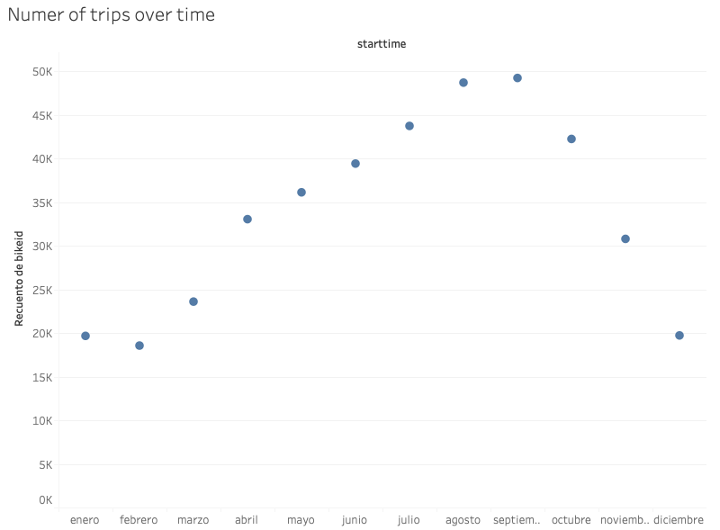
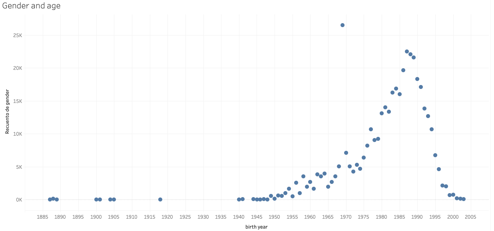
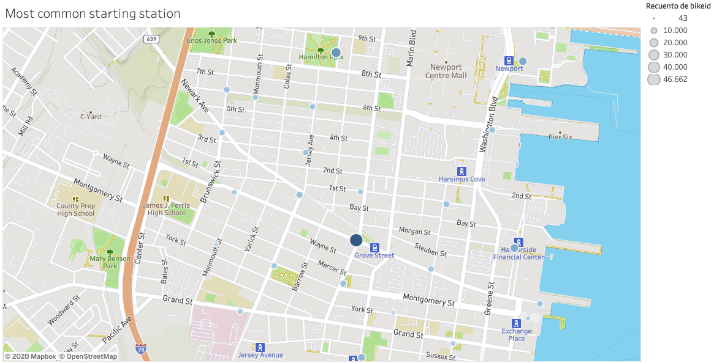

# Tableau Analysis of Boston Cyclists

Analysis about Boston's city bycicle data. The analysis includes

* Number of trips
* Genders
* Trip duration
* Starting station
* Ending station
* Changes in the trip duration

The graphs in Tableau can be found in:

https://public.tableau.com/profile/abraham7590#!/vizhome/TableauHomework_15977123738860/NumberofTrips

